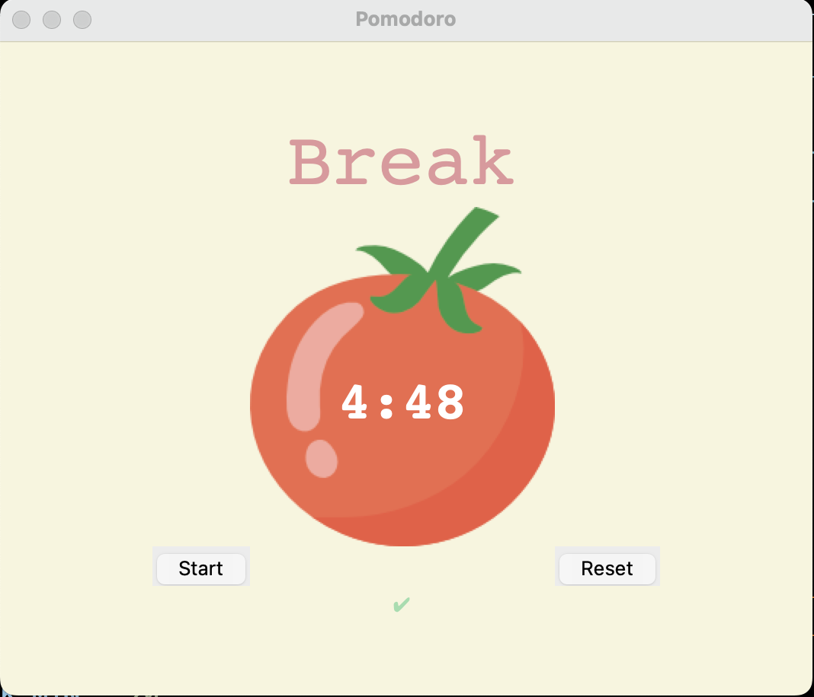

# Pomodoro App 

  ## Description

  This is an app built using Python which assists the user to use the "Pomodoro Technique", which is a time management technique used for work to improve productivity. It is essentially a timer where the timer is set for 25 minutes, the user works on a task until the timer is up, then takes a short break for 5 minutes.  After 25 minutes the window pops up to inform user to take a break.  This (25 minutes of work + 5 minutes break, a.k.a. a "Pomodoro") is repeated 4 times.  After 4 repetitions, you take a 15-30 minute break.  The Pomodoro Technique helps with information retention and keeping motivated.

  Screenshot:

  
  
  
  ## Table of Contents
  
  - [Installation](#installation)
  - [Usage](#usage)
  - [License](#license)
  - [Contributing](#contributing)
  - [Tests](#tests)
  - [Questions](#questions)
  
  ## Installation
  
  run main.py in terminal
  
  ## Usage
  
  Hit start button to initiate the timer countdown when you are ready to work on a task.  When timer reaches 25 minutes, it will tell you that it is time for a 5 minute break.   This will repeat 4 times at which time it will be time for a longer, 20 minute break.

  ## License
This application is covered under the MIT License.
 For more information: https://opensource.org/licenses/MIT
  
  ## Contributing
  N/A
  
  ## Tests
  N/A

  ## Questions
  Contact Info 
  GitHub user name: BillStephens2022 
  Link to GitHub profile: https://github.com/BillStephens2022 
  Email: stephensbill17@gmail.com